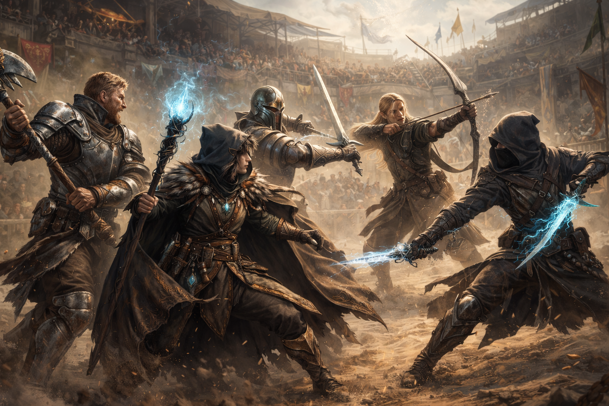

# POO - Ejercicio 4: El Torneo

Ha llegado el momento de poner tus habilidades de programador y jugador en marcha. Vamos a crear un torneo entre 5 personajes.

Para ello, crea una clase Torno (en Torneo.java). En ella, haz lo siguiente:

1. Crea 5 personajes, con 5 armas y guárdalos en un array. Los niveles y puntos máximos de vida de cada personaje así como el daño de sus armas deben ser aleatorios.
2. Presenta los personajes. Muestra por pantalla quienes son los personajes que van a combatir y sus características.
3. Programa un bucle de combate. En él deberás:
	- Elegir aleatoriamente qué personaje ataca y qué personaje es atacado.
	- Mostrar por consola el ataque (quien ataca a quien y con qué arma) y el resultado.
	- Comprobar que al menos hay dos personajes vivos para continuar el combate.
4. Al finalizar el torneo, muestra por consola quien es el ganador.

** Este ejercicio no tiene tests asociados **

