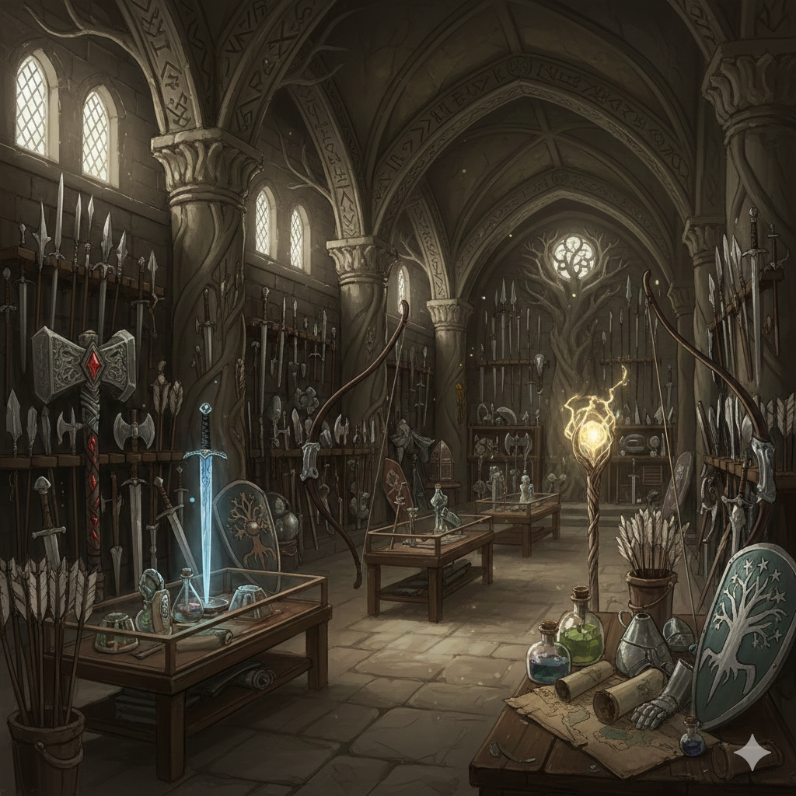

# POO - Ejercicio 5

## Objetivo:
Relaciones de herencia.

## 1. Simplifica la Clase Arma
Tenemos un error de diseño en la clase Arma: esta clase no necesita conocer a su propietario. Elimina el atributo propietario, su getter, su setter y el método atacar. Los ataques los realizarán los personajes, no las armas.
	
Haz los cambios que necesites en los tests y el resto de clases.

## 2. Crea la Clase Guerrero
Esta clase heredará de Personaje y tendrá:

- **Atributos Privados**:
	- *Fuerza*: entero entre 1 y 50.

- **Métodos**:
	- *Constructor*: recibirá todos los parámetros necesarios para llamar al constructor de la clase padre y además, el valor de la fuerza del Guerrero.
	- *atacar*: sobreescribe el método atacar para que sus ataques con arma o sin ella incrementen el daño causado en el valor de la fuerza del Guerrero. Fíjate que tendrás que reprogramar el método Arma.atacar.

## 3. Crea la Clase Mago
Esta clase heredará de Personaje y tendrá:

- **Atributos Privados**:
	- *Maná*: entero entre 1 y 100. Indica el valor de maná mágico que tiene el mago.
	- *Maná Máximo*: entero entre 1 y 100. Indica el máximo valor de maná que puede tener.

- **Métodos**:
	- *Constructor*: recibirá todos los parámetros necesarios para llamar al constructor de la clase padre y además, el valor del maná máximo.
	- *hechizar*: recibirá como parámetro el personaje a hechizar y el maná utilizado por el mago, salvo si el mago tiene un "Arma Mágica" (ver a continuación). El maná utilizado por el mago no podrá ser superior al maná disponible y será restado del maná disponible. El daño causado al personaje hechizado será la suma del nivel del mago y el maná utilizado. Si el mago utiliza un Arma Mágica, el daño del arma se sumará al daño causado. Ten en cuenta que un mago sólo puede llevar un arma (normal o mágica). Si el arma no es mágica, no se puede sumar su daño al hechizo.
	- *atacar*: sobreescribe el método atacar para evitar sumar el daño del arma al ataque del mago si el arma que tiene es un arma mágica.

## 4. Crea la Clase Arma Mágica
Esta clase heredará de Arma. Las armas mágicas solo podrán ser poseídas por personajes de tipo Mago. 
Piensa cómo tienes que hacerla.
	

No olvides desarrollar los getters y setters que necesites.

***Nota:*** los tests vuelven a estar hechos con JUnit5.
